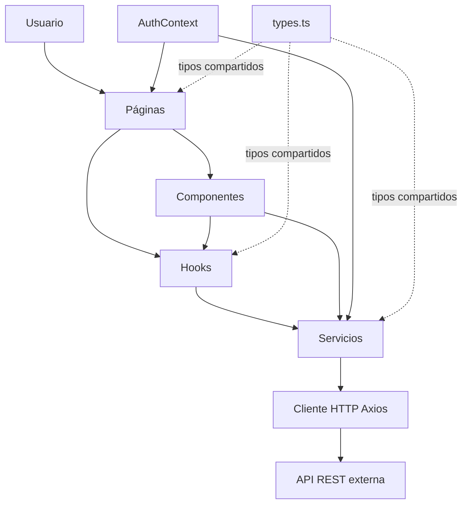
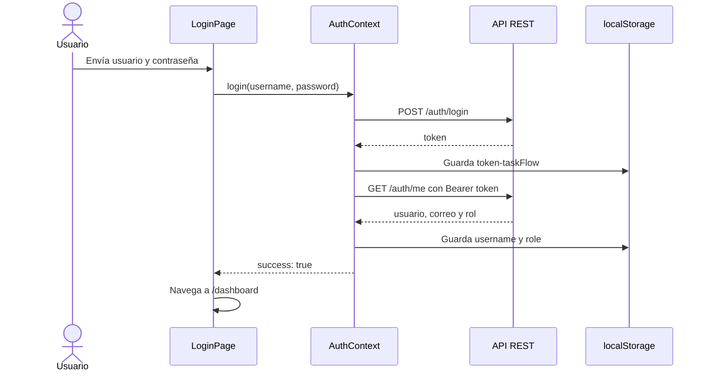

# Arquitectura de TaskFlow

## 1. Descripción general

TaskFlow es el frontend de una aplicación para gestionar proyectos y tareas. La
persistencia de datos, la autenticación y las reglas de negocio dependen de una
API REST externa.

La aplicación permite:

- iniciar y cerrar sesión;
- crear, consultar, editar y eliminar proyectos;
- crear, consultar, editar y eliminar tareas;
- cambiar el estado, la prioridad y la fecha límite de una tarea;
- mostrar el progreso de carga y los errores devueltos por la API.

## 2. Tecnologías

| Tecnología | Uso |
| --- | --- |
| React 19 | Construcción de la interfaz con componentes |
| TypeScript | Tipado de datos, propiedades y respuestas de la API |
| Vite | Servidor de desarrollo y compilación para producción |
| React Router | Navegación y protección de rutas |
| Material UI | Componentes visuales y diseño adaptable |
| Axios | Comunicación HTTP con la API REST |
| oxlint | Análisis estático del código |

El proyecto requiere Node.js 20 o posterior y npm.

## 3. Arquitectura

El código está separado por responsabilidades:



- **Páginas:** componen las pantallas y coordinan la navegación y los datos.
- **Componentes:** contienen formularios, listas, tarjetas y diálogos.
- **Hooks:** reúnen el estado y las operaciones reutilizables.
- **Servicios:** convierten las acciones de la interfaz en solicitudes HTTP.
- **Contexto:** mantiene el estado global de autenticación.
- **Utilidades:** construyen rutas y validan parámetros.
- **Tipos:** definen los contratos TypeScript compartidos.

## 4. Estructura del proyecto

```text
tasksFlow/
├── public/                  Recursos estáticos
├── src/
│   ├── components/          Formularios, listas, elementos y acciones
│   ├── config/              Configuración de la URL de la API
│   ├── context/             Estado global de autenticación
│   ├── hooks/               Estado reutilizable y operaciones
│   ├── pages/               Pantallas asociadas a las rutas
│   ├── services/            Acceso a autenticación, proyectos y tareas
│   ├── utils/               Construcción y validación de rutas
│   ├── App.tsx              Tema, proveedores y rutas
│   ├── ProtectedRoute.tsx   Control de acceso a rutas privadas
│   ├── main.tsx             Punto de entrada de React
│   └── types.ts             Modelos y constantes compartidas
├── index.html               Documento HTML raíz
├── package.json             Dependencias y scripts
└── vite.config.ts           Configuración de Vite
```

## 5. Inicio de la aplicación

`src/main.tsx` renderiza `App` dentro de `StrictMode`. A su vez, `App.tsx`
configura:

1. `ThemeProvider` y `CssBaseline` para los estilos de Material UI.
2. `AuthProvider` para compartir la sesión.
3. `BrowserRouter` para la navegación.
4. `Routes` para relacionar cada URL con su página.

El `basename` se obtiene de `import.meta.env.BASE_URL`, lo que permite publicar
la aplicación en una ruta distinta de `/`.

## 6. Rutas

| Ruta | Página | Acceso | Función |
| --- | --- | --- | --- |
| `/login` | `LoginPage` | Público | Inicio de sesión |
| `/dashboard` | `DashboardPage` | Protegido | Lista y creación de proyectos |
| `/projects/:projectId/tasks` | `ProjectTasksPage` | Protegido | Proyecto y sus tareas |
| Cualquier otra | Redirección | Según destino | Envía a `/dashboard` |

`ProtectedRoute` consulta `isAuthenticated` mediante `useAuth`. Si no hay una
sesión activa, redirige a `/login`; de lo contrario, muestra la ruta hija con
`Outlet`.

`parseProjectId` solo acepta enteros mayores que cero. Cuando el parámetro no es
válido, la página muestra un error y no consulta la API.

## 7. Autenticación

La autenticación involucra `AuthContext`, `authService`, `httpClient` y
`ProtectedRoute`.



### Datos guardados en el navegador

| Clave | Contenido | Uso |
| --- | --- | --- |
| `token-taskFlow` | Token de acceso | Autorización y estado inicial de sesión |
| `username` | Nombre del usuario | Mensaje de bienvenida |
| `role` | Rol del usuario | Información del dashboard |

Antes de cada solicitud, el interceptor de `httpClient` agrega el token a la
cabecera `Authorization`. Al cerrar sesión se eliminan las tres claves. También
se limpia la sesión cuando falla el inicio de sesión o la consulta de
`/auth/me`.

## 8. Proyectos

### Consulta

`DashboardPage` obtiene los proyectos mediante `useProjects` y
`useApiResource`. `ProjectList` muestra el resultado y `ProjectItem` representa
cada proyecto.

Al seleccionar un proyecto se abre `/projects/{id}/tasks`. La tarjeta admite
clic, `Enter` y barra espaciadora. Los botones de edición y eliminación no
activan la navegación de la tarjeta.

### Creación

`ProjectForm` exige un nombre de al menos tres caracteres. Antes de enviar el
formulario, elimina los espacios sobrantes del nombre y la descripción. Cuando
la API responde correctamente, limpia los campos y vuelve a solicitar la lista.

### Edición y eliminación

`ProjectActions` contiene los diálogos y `useProjectActions` gestiona su estado.
La edición usa `PUT /projects/{id}` y la eliminación usa
`DELETE /projects/{id}`. Mientras una operación está activa, las acciones quedan
bloqueadas para evitar solicitudes repetidas.

El nombre editado debe tener entre 3 y 80 caracteres. La interfaz avisa que al
eliminar un proyecto también se eliminan sus tareas; la API es responsable de
aplicar esa regla.

## 9. Tareas

`ProjectTasksPage` solicita por separado los datos del proyecto y sus tareas:

- `GET /projects/{projectId}` obtiene el proyecto;
- `GET /projects/{projectId}/tasks` obtiene sus tareas.

Cada solicitud conserva sus propios estados de carga y error. Así, la lista de
tareas puede mostrarse aunque falle el detalle del proyecto.

### Creación

`TaskForm` acepta título, descripción, prioridad y fecha límite. El título debe
tener entre 3 y 120 caracteres y la prioridad inicial es `MED`. Una fecha vacía
se envía como `null`; una descripción vacía se omite.

Después de crear una tarea, el formulario se limpia y la lista se actualiza.

### Edición, estado y eliminación

`TaskItem` muestra la información y los diálogos. `useTaskActions` gestiona las
operaciones:

- `PUT /tasks/{id}` actualiza los datos de una tarea;
- `PATCH /tasks/{id}/status` cambia su estado;
- `DELETE /tasks/{id}` la elimina después de pedir confirmación.

Los estados válidos son `TODO`, `IN_PROGRESS` y `DONE`. Las prioridades válidas
son `LOW`, `MED` y `HIGH`.

## 10. Carga y actualización de datos

`useApiResource<T>` recibe una función de carga, un valor inicial y una bandera
`enabled`. Devuelve `data`, `loading`, `error` y `refetch`.

`refetch` cambia una clave interna que vuelve a ejecutar la carga. Al desmontar
el componente, el efecto descarta cualquier respuesta pendiente para no
actualizar un estado que ya no existe. La solicitud de Axios no se cancela.

La aplicación no usa actualizaciones optimistas ni una caché compartida. Tras
crear, editar o eliminar un elemento, vuelve a solicitar los datos al servidor.

## 11. API esperada

| Método | Endpoint | Cuerpo o parámetros | Respuesta |
| --- | --- | --- | --- |
| `POST` | `/auth/login` | `{ username, password }` | `{ token }` |
| `GET` | `/auth/me` | Ninguno | Usuario autenticado |
| `GET` | `/projects` | Ninguno | `Project[]` |
| `GET` | `/projects/{id}` | Ninguno | `Project` |
| `POST` | `/projects` | `NewProject` | `Project` |
| `PUT` | `/projects/{id}` | `UpdateProject` | `Project` |
| `DELETE` | `/projects/{id}` | Ninguno | Sin cuerpo requerido |
| `GET` | `/projects/{id}/tasks` | Ninguno | `Task[]` |
| `POST` | `/projects/{id}/tasks` | `TaskRequest` | `Task` |
| `GET` | `/tasks` | `status` y/o `priority` opcionales | `Task[]` |
| `GET` | `/tasks/{id}` | Ninguno | `Task` |
| `PUT` | `/tasks/{id}` | `TaskRequest` | `Task` |
| `PATCH` | `/tasks/{id}/status` | `{ status }` | `Task` |
| `DELETE` | `/tasks/{id}` | Ninguno | Sin cuerpo requerido |

Las pantallas consultan las tareas por proyecto. `taskService` también incluye
la consulta general y la consulta de una tarea individual.

### Modelos principales

```ts
interface Project {
  id: number;
  name: string;
  description?: string;
  ownerId: number;
  createdAt: string;
}

interface Task {
  id: number;
  title: string;
  description?: string;
  status: "TODO" | "IN_PROGRESS" | "DONE";
  priority: "LOW" | "MED" | "HIGH";
  projectId: number;
  dueDate?: string | null;
}
```

## 12. Configuración de la API

La URL base se resuelve en este orden:

1. `VITE_API_URL`, si está definida.
2. `/api` durante el desarrollo.
3. `https://d3ujwk09smrk9z.cloudfront.net` en producción.

`getApiBaseUrl` elimina la barra final para evitar URLs con una doble barra. Para
usar otro servidor, se puede crear un archivo `.env`:

```env
VITE_API_URL=http://localhost:8080
```

Las variables expuestas por Vite forman parte del código que llega al
navegador. `VITE_API_URL` no debe contener secretos.

## 13. Errores y operaciones en curso

`getApiErrorMessage` traduce los errores de Axios:

- un error `401` se muestra como credenciales incorrectas;
- otros errores HTTP incluyen el código de estado y el mensaje de Axios;
- los errores sin respuesta se identifican como problemas de red;
- los valores desconocidos producen `Unknown error`.

Las listas muestran un indicador mientras cargan, un aviso cuando la solicitud
falla y un mensaje cuando no hay elementos. Los formularios y hooks desactivan
sus acciones durante cada solicitud para evitar envíos repetidos.

Los errores de algunas operaciones usan directamente `err.message`, mientras
que las lecturas y el inicio de sesión pasan por `getApiErrorMessage`. Por eso el
formato de los mensajes puede variar.

## 14. Desarrollo y validación

Instalar dependencias:

```bash
npm install
```

Iniciar el servidor de desarrollo:

```bash
npm run dev
```

Ejecutar las comprobaciones antes de publicar cambios:

```bash
npm run lint
npm run build
```

Probar el paquete generado:

```bash
npm run preview
```
